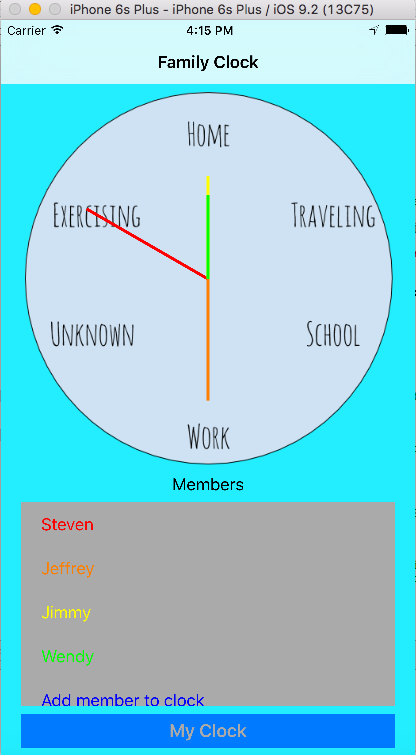
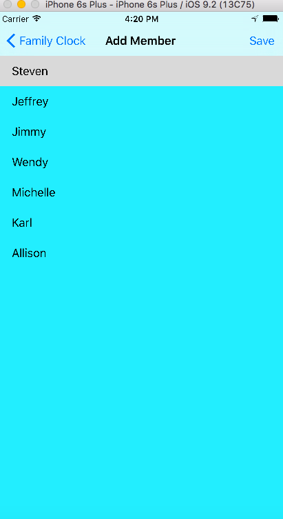
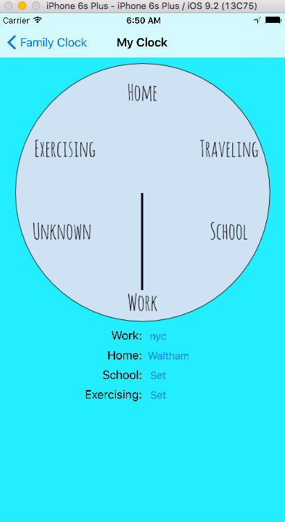
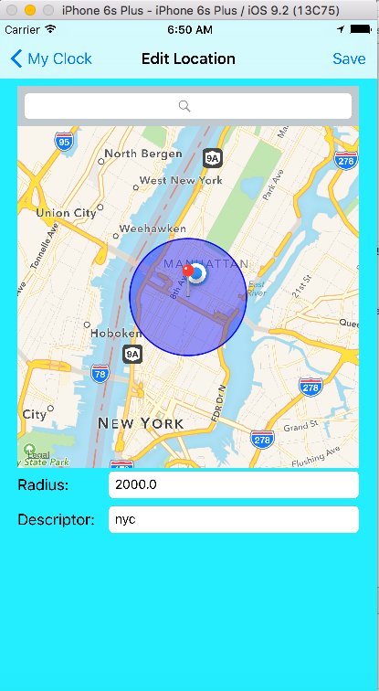

# Overview
The goal of this app was to implement a ''clock'' that would tell the user the general location of their friends/family. Part of this entailed having the user define what locations like ''home'' and ''work'' were for them. Using geofencing, the app determines when the user is in the user defined location and updates the database of all user info with their current location. Friends who have the user in their ''friend list'' will then be able to see if the user is at ''home'' or at ''work'', for example.

# How to Use
##All Members Clock Screen

When first starting up the app, there is a picture of a clock, a table view, and a button to edit 'My Clock'. The clock, once friends have been added, will display the name of the friend as well as a color to indicate which clock hand is theirs. The clock hand should show the location the user's current location. 

# Adding a Member Screen

When clicking on a cell in the table view, there will be a segue to a table view controller with a list of database entries. These entries are all pulled from Parse, with the ability to pull down on the table to refresh in case something was added while the user was on the screen. The current entries are all names I put into the database already with locations. 

After clicking on a cell in the table view, the 'save' button will become enabled. The highlighted row will be saved when the user clicks `save' and added to the clock view and table view in the All Members Clock view controller. Up to six members can be added (I chose six so that it would not clutter up the clock).

# My Clock Screen

When clicking on the button that says 'My Clock' at the bottom of the All Member Clock screen, the user can see their own clock. Next to each location type is a button that says 'Set' if there is no information in it yet, or a description of the user inputted location if the location has been set before. 

# Map View Controller

By clicking on one of the 'Set' buttons, for example, the one next to 'School:', we segue to a map view controller. This map view controller allows us to search for a location. For example, I could search Harvard University and the map should zoom to Harvard. Then, I can set a radius and an overlay should appear on the map indicating the radius that was just inputted. Once a description is entered, the save button will be enabled. By pressing save, the app starts monitoring the geolocation (x meters around Harvard) and when the user enters or exits. The app also saves this location to NSUserDefaults. Upon returning to the My Clock scene, there should be a hand that indicates where the user is. If the user is in the location just set, then the hand should point to 'School'. However, if the user is outside any of the defined locations, then the hand should point to 'Unknown'. 

# Example
Here are some example run throughs of the code.

# Adding the User's Info

  1. Start up the app and click on the 'My Clock' button.
  2. In my XCode, under Manage Scehems, I have 'Allow Location' checked and the default Location as New York, NY, USA. Click on the 'Set' button next to 'Work:'
   3. The map view should show the current user location as NYC. Search New York, New York in the search bar and we should zoom in pretty close to the user location.
  4. Enter something like 2000 in the radius 
  5. Enter something like NYC under the description
  6. Hit `save'
  7. We should be back at the My Clock screen now. As long as the default location was set as New York, New York, the clock should now display 'Work'.
  8. In the simulator, try changing the Longitude to -74.2. This will likely put your current location outside of the set NYC location. The clock should change to 'Unknown'.
    9. Try adding other locations through the other 'Set' buttons and changing the locations around! As one example, search 175 South Street, Waltham MA in the search bar and set some radius for this location (I've put 25 before and it worked okay). Then go back to the 'My Clock' screen and change the latitude to 42.370049 and the longitude to -71.250268. This should put the user in the location of 175 South Street, and the clock hand should change accordingly. 

All of these saved locations should be saved to NSUserDefaults so the user's location preferences are saved even after the app is closed. Furthermore, each time the user's current location is changed (when a geofence is triggered), the location is written to a database using Parse.

## Finding Other People's Locations
Now that our own locations are set, we can add other people's too!

  1. Click on one of the six table cells
  2. Choose one of the names in the database and click `save'.
  3. The name that was just clicked should show up in the table view and their location on the clock in the corresponding color
  4. In addition to all of the names, there should be one called 'Tester' too if the first example was followed. 'Tester' is you, and its location should be where you are right now. Try adding 'Tester'
  5. Now, try changing your location to either 'Unknown' or into one of your set geolocations. Because I only pull from Parse on viewDidAppear(), you may have to click into another screen and click back into this screen to see the update. Basically, when your location changes, the parse database entry is updated. However, I did not know how to make the database send a Notification that something in it changed, so I kept the Parse pulling in viewDidAppear() with the intention of adding a refresh option, though I only found how to do this with table view controllers. 

# Further Work
I believe I accomplished all of my goals except for determining if the user is traveling. I have an idea for how to do this using the Core Motion framework using \href{https://developer.apple.com/library/ios/documentation/CoreMotion/Reference/CMMotionActivity_class/}{CMMotionActivity} but did not get the chance to implement it.

I used navigation through MapKit geofencing, persistence by saving the user settings to NSUserDefaults, and background tasks when fetching data from Parse. I was not able to save which 'friends' the user saved to their All Members Clock table to NSUserDefaults but I believe it would be done in a similar way as I saved the user locations.

I did not know what was the best way to save the user themselves into the database so right now I just have the name ''Tester'' hard coded as name. Ideally, the user would set up some sort of unique username but I believed that was beyond the scope of what I had planned. I have ''Tester'' being saved or updated to Parse once the user clicks 'save' on their first geolocation (since if they haven't set any locations, they shouldn't be in the database). Therefore, ''Tester'' should only save the first time, with the rest of the time being updates. This was not the ideal solution, but the one that I could think of given my current knowledge of Swift/databases. 

I did not make the screen scroll up when the keyboard was in use- this made using the app on my phone rather a pain but I did not have any problems in the simulator since I could type all of my entries in without the screen keyboard.

Haven't implemented traveling

Haven't saved the user's friends to NSUserDefaults

Reload on the main screen is not ideal- would be better if the database could send a notification that it had changed and then I could call something like updateUI(). 

I ran into a problem when using the hotel wifi to take screenshots where the method pullDataFromParse() in viewDidAppear() was having problems on the background thread. Originally, I was using query.getObjectInBackgroundWithId() which seemed to work fine on my home internet. However, because it is being executed in a for loop, if the background thread does not finish with the query quickly enough, an exception occurs. I did not know how to fix this so I moved getting the object back onto the main thread. This gives me warnings that there is a long process on the main thread, but I thought it was better than the exception crashing.
